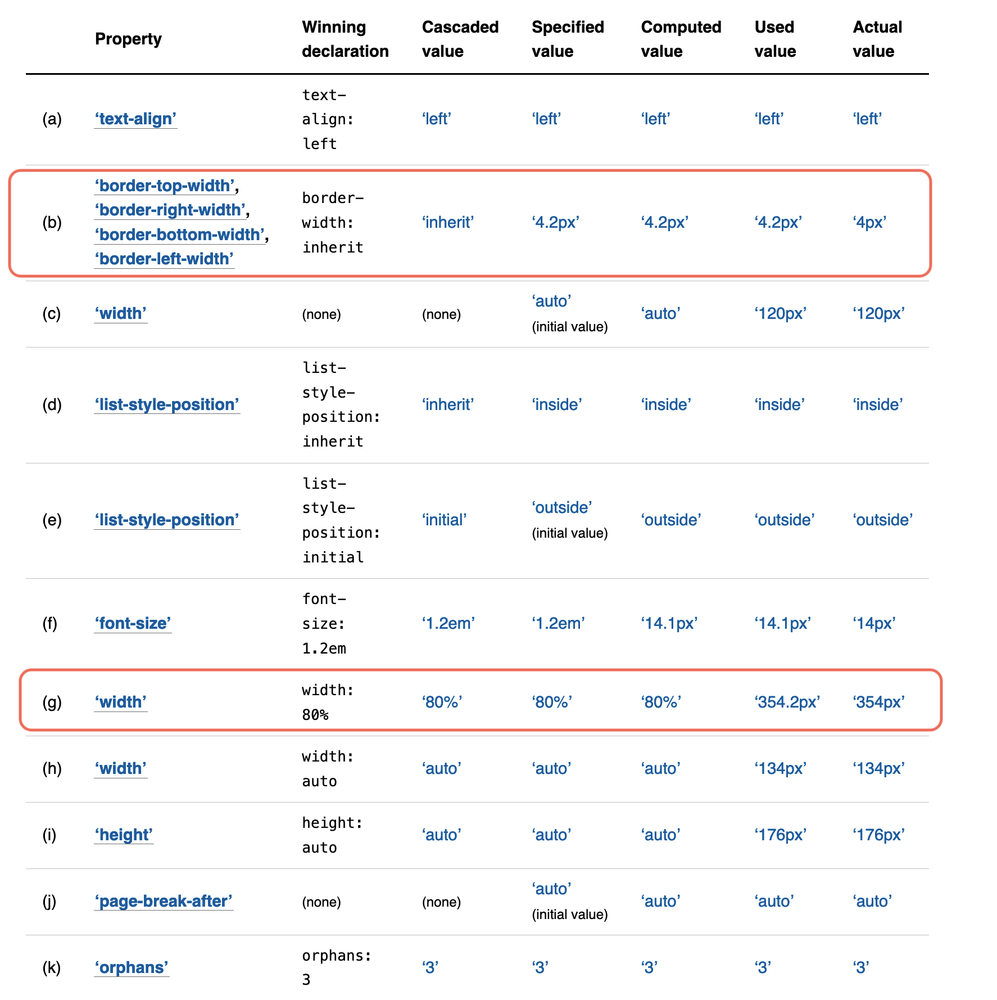

# W3C CSS spec/draft を読む時に役立つValue Processingの概念

@arayaryoma

2020/09/01 #納涼_study

---

W3C Understanding the CSS Specifications(https://www.w3.org/Style/CSS/read)にはCSS specはまずこれを読めと書いてある。

この中でも、[CSS Cascading and Inheritance](https://www.w3.org/TR/css-cascade-4/)に記述されているValue ProcessingはCSSのspec/draftを読む際にたいへん役立つためここで紹介する。

---
[Value Processing](https://www.w3.org/TR/css-cascade-4/#value-stages)には、UAが、parseしてtree化したdocumentのelementに対してstyleを適用する、
最終的な値を計算するときの処理手順が記載されている。

この一連の計算ではparseされたstylesheetの値は下記の順に計算/変換されていく。

これらの語彙はCSS spec/draftのいたるところで出てくるため、これを知っておくとspec/draftがかなり読みやすくなる。

1. declared values
2. cascadced values
3. specified values
4. computed values
5. used values
6. actual values

---
## declared values
stylesheetで宣言された値。同じpropertyに対し複数存在する可能性があり、順不同リストとしてcascading(別の章)に渡される。

---
## cascaded values
cascadingの結果の値。declared valuesの中で、cascadeに勝利したもの。

---
## specified values
cascaded valueにdefaultingを通した結果。

stylesheetの作成者が指定したすべてのelementのすべてのpropertyに存在することが保証されている。

### *[defaulting](https://www.w3.org/TR/css-cascade-4/#defaulting)
Initial values, Inheritance, keywordからspecified valueを決定する

---
## computed values
- 相対値は絶対値化される 
- 計算コストが高い絶対値化はここでは行わない(`width: auto`など)
- 継承ではこの値が親から子へ継承される
- property definition tableで定義されている方法で解決される。
- getComputedStyle()はこの値を返すわけではない
- Chrome Devtools のComputedもこの値ではない
---
## used values
- レイアウトで使われる絶対理論値
- widthなどは祖先のレイアウトを決定してからじゃないと解決できないため、ここで初めて絶対値化される。

---
## actual values
- used valuesがそのまま使えない場合はもう1ステップある
- floatはintに丸められる
- 「ここを見ればすべてのレイアウト結果がわかる」というわけではない
  - `page-break-after` など

---
## [value processingの例](https://www.w3.org/TR/css-cascade-4/#stages-examples)
